# Chopinote-AI

> Give it a few bars — it finishes the piece.
> 给它几个小节，它还你一首完整的乐曲。

Chopinote-AI is a **decoder-only Transformer** (1.21B parameters) that composes classical piano music in the style of your input. Feed it the first few measures of a piece (MusicXML), and it generates a stylistically coherent continuation — with structural awareness of musical form, tonal harmony via SSF encoding, and a six-layer ABC cognitive engine for real-time quality control.

Output is standard MusicXML, editable in MuseScore, Finale, Sibelius, or any notation software.

Chopinote-AI 是一个 **decoder-only Transformer**（12.1 亿参数），能根据输入的音乐片段续写出风格一致的作品。给它几个小节（MusicXML 格式），它就能生成结构完整、和声合理、声部清晰的古典钢琴音乐。输出为标准 MusicXML，可直接在 MuseScore、Finale、Sibelius 等制谱软件中编辑。

---

<div align="center">

**[[English](#english)] [[中文](#中文)]**

</div>

---

# English

## Why Chopinote-AI?

Most music generation models treat composition as a pure sequence prediction problem. Chopinote-AI takes a different approach — it embeds **music theory as first-class architectural priors** rather than hoping the model learns them implicitly.

### 1. SSF (Sliding Scale Field) — Continuous Tonal Encoding

Instead of discrete key/chord tokens, v0.3.x uses a **12-dimensional tonic-anchored chroma field** that continuously represents harmonic context. Modulation, chromaticism, and harmonic ambiguity are encoded naturally as continuous vectors — no discrete vocabulary needed.

```mermaid
flowchart TB
    subgraph "Three-Granularity SSF"
        direction TB
        NT[Note Pitch Intervals] --> CH[12-dim Chroma Histogram]
        CH --> TF[TonicField<br/>Section-level<br/>normalized vector]
        TF --> LF[LocalField<br/>Bar-level<br/>sparse delta δ]
        TF --> BF[BeatField<br/>Beat-level<br/>per-position vector]
    end
    subgraph "Injection"
        TF --> PROJ[ssf_proj<br/>nn.Linear(12, 2048)]
        LF --> PROJ
        BF --> PROJ
        PROJ --> HID[Hidden State d_model=2048]
    end
    subgraph "Auxiliary Supervision"
        HID --> RECON[SSFReconstructionHead<br/>12-dim MSE Regression]
    end
```

| Field | Scope | Content | Storage |
|-------|-------|---------|---------|
| **TonicField** | Section-level | 12-dim chroma histogram, tonic-anchored at position 0, normalized to [0,1] | Always stored |
| **LocalField** | Bar-level | Sparse delta from parent TonicField (only when \|δ\| > 0.15) | Sparse |
| **BeatField** | Beat-level | Per-position SSF vector within each bar (v0.3.3) | Sparse |

**Key insight**: The tonic is ALWAYS at position 0 of the 12-dim vector. A C-major chord and a G-major chord in the key of C are different points in the same continuous space — the model naturally learns their relationship through MSE regression on the 12-dim field, rather than treating them as unrelated discrete symbols.

### 2. Four-Voice SATB Time Slicing

Four simultaneous voices (Soprano/Alto/Tenor/Bass) modeled with per-voice identity, replacing 512 discrete Program tokens with 43 Program × 4 subtracks (172) + 4 Voice tokens.

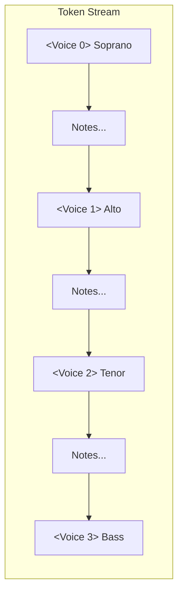

| Mechanism | Role |
|-----------|------|
| **Voice Embedding** | Per-voice identity (zero-init for training stability) |
| **Voice Bias** | Same-voice history attraction + same-position cross-voice coordination |
| **Voice Count Embedding** | Number of active voices per bar (1–4) |

### 3. ABC Engine — Six-Layer Cognitive Architecture

The core innovation: a **perception → generation → decision → evolution** pipeline where the Transformer is the central generation engine, surrounded by four cognitive layers.

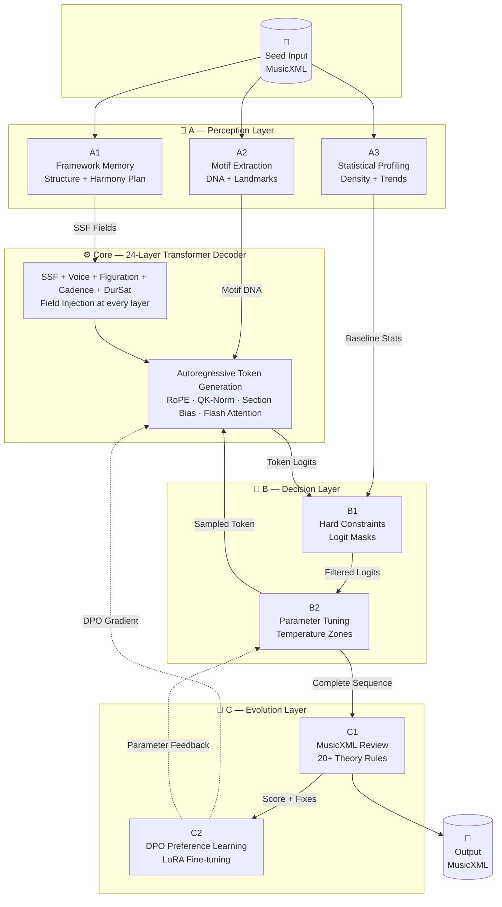

The Transformer sits at the **center** of the ABC Engine — it is the generation engine, not the whole system. A perceives and plans, B constrains and tunes, C reviews and evolves. The Transformer generates autoregressively, with SSF/voice/figuration/cadence fields injected at every layer, while B1 applies logit-level bans in real time.

| Layer | Subsystem | Function |
|-------|-----------|----------|
| **A1** | Framework Memory | Section planning (sonata, binary, theme-variations, free), harmonic progression templates, SSF field pre-computation via `harmony_to_ssf()` |
| **A2** | Motif Extraction | Seed motif DNA (contour, rhythm, register), landmark detection, motif transformation ops (invert, fragment, diminish) |
| **A3** | Statistical Profiling | Baseline per-bar density/rest_ratio, section snapshots, trend detection, duration tracking (DurSat) |
| **B1** | Hard Constraints | Voice range (SATB pitch limits), parallel fifths/octaves, voice crossing, duration overflow guard, note density caps |
| **B2** | Parameter Tuning | Temperature zone annealing (cold→hot→cold per section), innovation budget tracking, fatal signal detection |
| **C** | Evolution | MusicXML legality check, theory evaluation (20+ rules), token↔XML cross-modal comparison, DPO preference pair collection → LoRA |

### 4. How Generation Works — End-to-End Pipeline

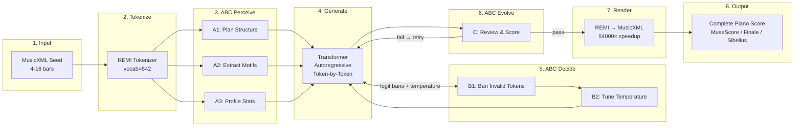

### 5. Section-Aware Attention — Musical Form as Learned Bias

Four complementary biases encode the formal structure of music directly into the attention mechanism:

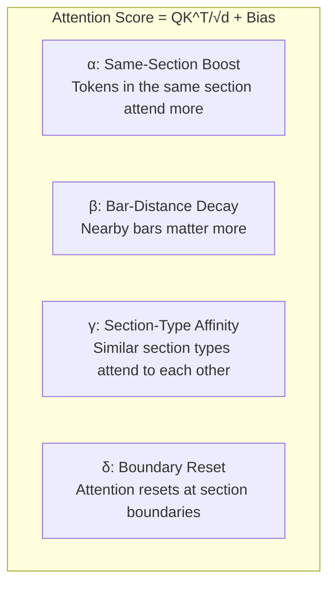

Each bias is a scalar learned parameter, scaled and added to the pre-softmax attention scores. During training, biases are **recomputed inside gradient checkpointing** — the raw section data (~1 MiB) is checkpointed rather than the full attention bias tensor (256 MiB), saving **6 GiB of VRAM across 24 layers**.

### 6. Explicit Musical Feature Injection

Instead of treating all tokens equally, Chopinote-AI injects domain-specific features at precise positions:

| Feature | Injection Point | Encoding | Dimension |
|---------|----------------|----------|-----------|
| **SSF Field** | All positions (hidden state) | `ssf_proj(12-dim chroma vector)` → added to hidden state | d_model |
| **Voice Identity** | Voice token positions | `voice_embedding` (4 SATB + 1 none) | d_model |
| **Figuration** | Figuration token positions | `fig_embedding` (11 piano textures + none) | d_model |
| **Cadence** | Cadence token positions | `cadence_embedding` (5 types + none) | d_model |
| **DurSat** | Position token positions | `dur_sat_embedding` (17 saturation buckets) | d_model |
| **Measure Position** | All positions | `measure_in_section_embedding` | d_model |
| **Functional Harmony** | Section/Bar/Beat | 3-granularity parallel embeddings | d_model |

All feature embeddings are **zero-initialized** — they start as identity and gradually learn their semantics, preventing training instability at initialization.

### 7. Figuration Encoding — 11 Piano Textures

Piano-specific figuration types are explicitly encoded rather than left for the model to infer:

```
Alberti bass  ·  Arpeggio  ·  Broken chord  ·  Chordal  ·  Octave
Scale  ·  Tremolo  ·  Trill  ·  Repeated notes
Melody + accompaniment  ·  Polyphonic
```

`fig_embedding: nn.Embedding(12, d_model)` — zero-init, injected at figuration token positions.

### 8. Cadence Awareness — 5 Types

Five cadence types with dedicated embedding + zone-based SSF boost at cadence approach positions:

| Type | Description |
|------|-------------|
| **PAC** | Perfect Authentic Cadence (V → I, both in root position, tonic in soprano) |
| **IAC** | Imperfect Authentic Cadence (V → I, non-root or non-tonic soprano) |
| **HC** | Half Cadence (ends on V) |
| **DC** | Deceptive Cadence (V → vi) |
| **PC** | Plagal Cadence (IV → I) |

### 9. DurSat (Duration Saturation) — v0.3.1

Per-voice cumulative duration tracking prevents rhythmic overflow. Each voice tracks its remaining beat capacity (0/16 ~ 16/16 in semiquaver grid), encoded as 17 saturation buckets and injected at Position token positions. B1 hard constraints block any Duration token that would exceed grid capacity.

### 10. Multi-Task Training — Auxiliary Structural Supervision

Three loss terms guide the model beyond next-token prediction:

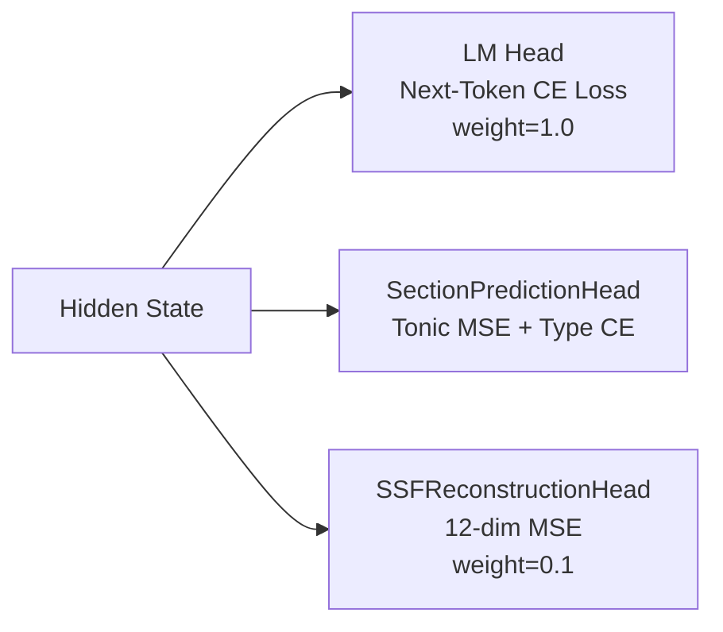

| Task | Head | Loss | Purpose |
|------|------|------|---------|
| Next-token prediction | LM Head (weight-tied with embedding) | Cross-entropy | Note fluency and style |
| Section type + tonic | SectionPredictionHead | CE + 12-dim MSE | Formal structure awareness |
| SSF reconstruction | SSFReconstructionHead | 12-dim MSE | Chroma field understanding |

### 11. Memory-Efficient Architecture

| Technique | Benefit |
|-----------|---------|
| **RoPE** (θ=10000) | 4.1× faster than ALiBi |
| **QK-Norm** + per-head scaling | Prevents attention logit explosion |
| **Bias recompute in checkpoint** | 6 GiB VRAM saved across 24 layers |
| **FP8 Linear** | Blackwell-native FP8 inference |
| **BF16 autocast** | No GradScaler needed |
| **Bias detach** | Combined bias detached before SDPA |
| **Flash / Efficient Attention** | 4D mask with SDPA backends |

---

## Data Pipeline

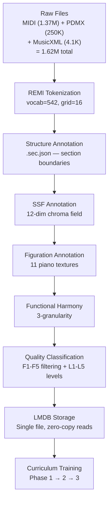

### LMDB Storage

All 1.6M+ samples (tokens, SSF, figuration, functional harmony, metadata) are stored in a **single LMDB file** instead of 3.2M+ individual JSON files:

| Metric | Flat Files | LMDB |
|--------|-----------|------|
| File count | 3,263,056 | **1** |
| `__getitem__` latency | ~500 μs (4× open+json.load) | **~50 μs** (1 cursor.get) |
| Dataset init peak memory | 300 MB | **~0 MB** |
| Disk usage | ~191 GB | **~29 GB** |

Tokens are stored as raw `uint32` LE bytes (struct.pack), annotations as msgpack — **zero-copy numpy.frombuffer → torch.from_numpy** for DataLoader reads.

---

## Training

### Three-Phase Curriculum (v0.3.1)

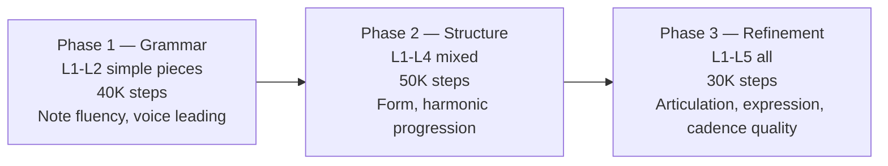

Gate mechanism: each phase auto-advances when validation loss plateaus or step target is reached.

### Hardware

| Component | Spec |
|-----------|------|
| GPU | RTX 5090 — 32 GB VRAM |
| Batch size | bs=8, grad_accum=4 (effective bs=32) |
| Data | ~1.62M files, ~13.7B tokens |
| Training speed | ~5–6 s/step (BF16) |
| Peak VRAM (training) | ~22 GiB |
| Checkpoint size | ~4.5 GB |

### Model Specs

| Parameter | Value |
|-----------|-------|
| Parameters | 1.21B |
| Layers | 24 |
| Attention heads | 32 |
| d_model | 2048 |
| d_ff | 8192 |
| Vocab size | **542** |
| Context length | 4096 tokens |
| Position encoding | RoPE (θ=10000) |
| Precision | BF16 training, FP8/BF16 inference |
| Tokenizer | REMI v4 (grid_size=16, velocity_levels=8) |

---

## Token Vocabulary (REMI v4, 542 tokens)

| Category | Count | Details |
|----------|-------|---------|
| Special | 4 | PAD, BOS, EOS, MASK |
| Structure | 3 | Bar, Section, SecSum |
| Tonic | 12 | `<Tonic C>` ~ `<Tonic B>` |
| Voice | 4 | SATB (`<Voice 0>` ~ `<Voice 3>`) |
| Position | 16 | Grid positions 0–15 |
| Note_ON | 96 | 12 pitch classes × 8 octaves |
| Velocity | 8 | Velocity levels |
| Duration | 16 | 1–16 sixteenth notes |
| Program | 172 | 43 programs × 4 subtracks |
| TimeSig | 14 | Time signatures |
| Tempo | 24 | 30–260 BPM, 10-bpm steps |
| Figuration | 12 | 11 types + none |
| Cadence | 6 | 5 types + none |
| Markings | ~70 | Clef, dynamic, hairpin, articulation, ornament, pedal |
| Other | ~85 | Rest, Beat, Tuplet, Octave, Arpeggio, Bass, Repeat, Jump |

**Removed from v0.2.x**: 30 Key tokens, 30 Anticipate, 21 Chord (func/7th/Inv), 508 unused Program — replaced by SSF, Voice, Tonic, Figuration, Cadence.

---

## Quick Start

```bash
# Install
pip install -e .

# Continue a piece (16 bars from seed)
chopin checkpoints/step_N.pt input.musicxml -o output.musicxml

# Generate multiple variants
chopin checkpoints/step_N.pt input.musicxml -n 5

# Custom config with style preset
chopin checkpoints/step_N.pt input.musicxml --config my_cfg.yaml --max-bars 64

# LMDB migration (flat files → single database)
python scripts/migrate_to_lmdb.py migrate \
    --tokens-dir /root/autodl-tmp/data/processed/tokens_v4 \
    --lmdb-path /root/autodl-tmp/data/processed/lmdb/chopinote_v4.lmdb \
    --workers 16 --verify

# SSF annotation (with LMDB output)
python scripts/generate_ssf.py annotate \
    --input-dir /root/autodl-tmp/data/processed/tokens_v4 \
    --lmdb-path /root/autodl-tmp/data/processed/lmdb/chopinote_v4.lmdb \
    --num-workers 25
```

---

## Key Design Documents

| Document | Topic |
|----------|-------|
| `docs/ssf_encoding_v0.3.x.md` | SSF tonic-anchored chroma field (三粒度) |
| `docs/voice_time_slicing_v0.3.x.md` | Four-voice SATB + Voice bias |
| `docs/figuration_encoding_v0.3.x.md` | 11 piano figuration types |
| `docs/cadence_awareness_v0.3.x.md` | Cadence zone + embedding |
| `docs/duration_saturation_v0.3.x.md` | 17-bucket DurSat + B1 guard |
| `docs/voice_splitting_v0.3.x.md` | Piano 2-track → 4-voice split |
| `docs/framework_content_separation_v0.3.x.md` | Framework/content separation (v0.3.1) |
| `docs/curriculum_training_v0.3.x.md` | F1–F5 filter + 3-phase curriculum |
| `docs/abc_engine.md` | ABC Engine full architecture |

---

## Version History

| Version | Key Changes |
|---------|-------------|
| **v0.2.6** | Section-aware attention, chord bias, 929 vocab |
| **v0.3.0** | SSF encoding, Voice SATB, Figuration, Cadence, 542 vocab, RoPE, ABC Engine |
| **v0.3.1** | Voice splitting, DurSat, F1–F5 filtering, 3-phase curriculum, cadence boost |
| **v0.3.2** | Framework/content separation, VoicePlan, A1 pre-inserted framework tokens |
| **v0.3.3** | BeatField (3-granularity SSF), functional harmony 3-granularity, LMDB storage |

---

# 中文

## 为什么选择 Chopinote-AI？

大多数音乐生成模型将作曲视为纯序列预测问题。Chopinote-AI 走了一条不同的路——它将**音乐理论作为一等架构先验**嵌入模型，而不是指望模型隐式地学会它们。

### 1. SSF（滑动音阶场）—— 连续调性编码

v0.3.x 用 **12 维主音锚定半音场** 替代离散的调性/和弦 token，连续表示和声语境。转调、半音化和和声模糊性自然地编码为连续向量——无需离散词表。

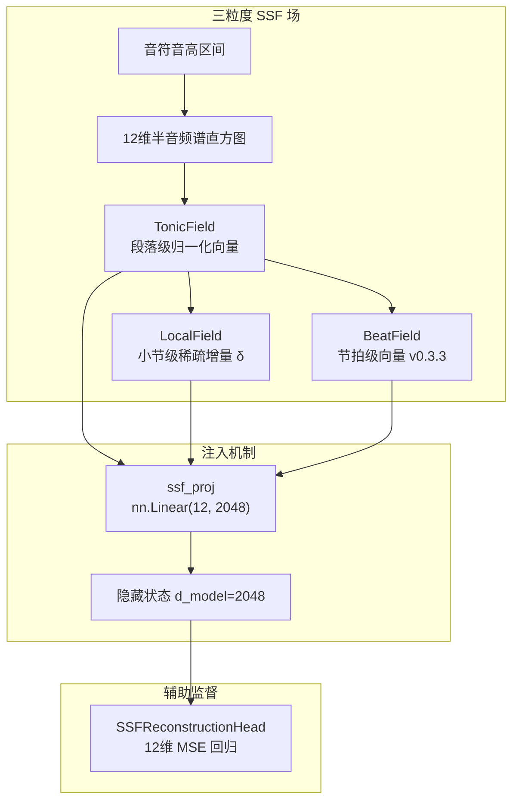

| 场 | 作用域 | 内容 | 存储 |
|---|--------|------|------|
| **TonicField** | 段落级 | 12 维半音频谱直方图，主音固定在位置 0 | 全量 |
| **LocalField** | 小节级 | 相对所属段 TonicField 的稀疏增量（\|δ\| > 0.15 才存） | 稀疏 |
| **BeatField** | 节拍级 | 每小节内各拍位的 SSF 向量（v0.3.3 新增） | 稀疏 |

**核心洞察**：主音永远在 12 维向量的位置 0。C 大调中的 C 大三和弦和 G 大三和弦是同一连续空间中的不同点——模型通过对 12 维场的 MSE 回归自然学习它们的关系，而不是把它们当作无关的离散符号。

### 2. 四声部 SATB 时间切片

四个独立声部（女高/女低/男高/男低）通过声部身份显式建模，512 个离散 Program token 被 43 Program × 4 子轨（172）+ 4 个 Voice token 替代。

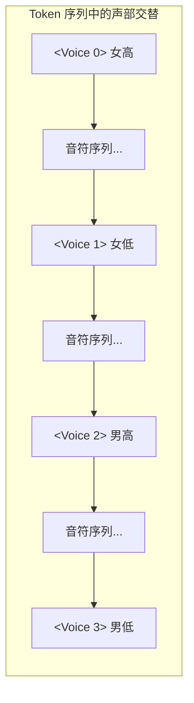

| 机制 | 作用 |
|------|------|
| **Voice Embedding** | 每声部独立身份嵌入（零初始化以保证训练稳定性） |
| **Voice Bias** | 同声部历史吸引力 + 同位置跨声部协调 |
| **Voice Count Embedding** | 每小节活跃声部数（1–4） |

### 3. ABC 认知引擎 — 六层认知架构

核心创新：**感知 → 生成 → 决策 → 进化** 流水线，Transformer 是中心的生成引擎，被四层认知层环绕。

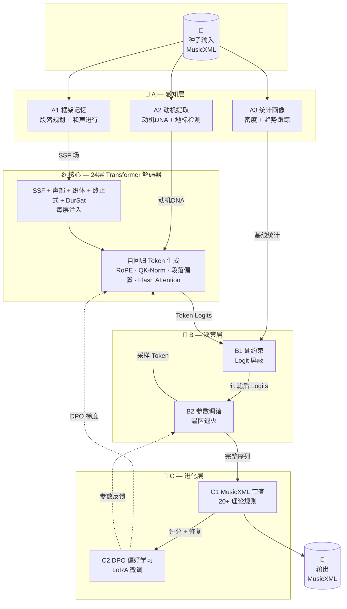

Transformer 位于 ABC 引擎的**中心**——它是生成引擎，而非整个系统。A 感知并规划，B 约束并调参，C 审查并进化。Transformer 逐 token 自回归生成，SSF/声部/织体/终止式场在每一层注入，B1 实时施加 logit 级屏蔽。

| 层 | 子系统 | 功能 |
|----|--------|------|
| **A1** | 框架记忆 | 段落规划（奏鸣曲式/二段体/主题变奏/自由），和声进行模板，SSF 场预计算（`harmony_to_ssf()`） |
| **A2** | 动机提取 | 种子动机 DNA（轮廓/节奏/音区），地标检测，动机变换（倒影/片段/减值） |
| **A3** | 统计画像 | 基线逐 bar 密度/休止比，段快照，趋势检测，时值饱和度跟踪（DurSat） |
| **B1** | 硬约束 | 声部音域限制，平行五八度禁止，声部交叉检测，时值溢出防护，音符密度上限 |
| **B2** | 参数调谐 | 温区退火（段内冷→热→冷），创新预算控制，致命信号检测 |
| **C** | 进化层 | MusicXML 合法性检查，20+ 理论规则评价，Token↔XML 跨模态比对，DPO 偏好对收集 → LoRA |

### 4. 端到端生成流水线

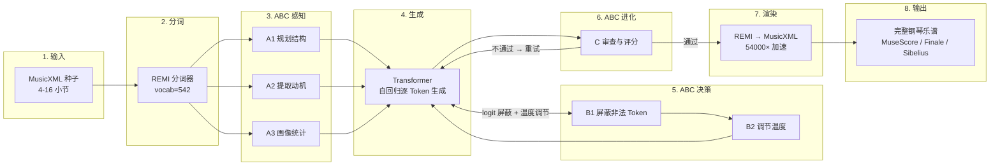

### 5. 段落感知注意力 — 曲式结构作为学习偏置

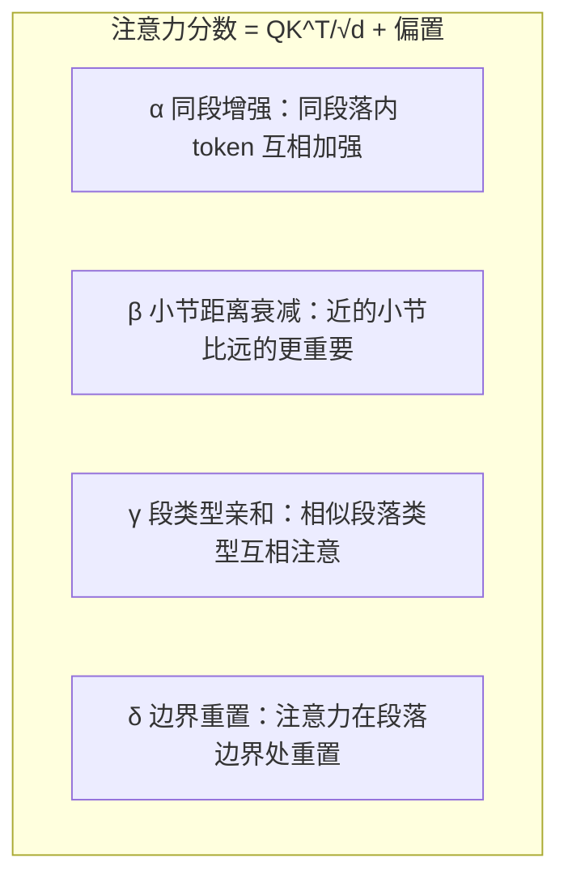

四个偏置在梯度检查点内**从原始数据重建**——checkpoint 只存 ~1 MiB 的原始数据而非 256 MiB 的完整注意力偏置，**24 层省 6 GiB 显存**。

### 6. 十一类钢琴织体显式编码

```
阿尔贝蒂低音 · 琶音 · 分解和弦 · 柱式和弦 · 八度
音阶 · 颤音 · 波音 · 重复音 · 旋律加伴奏 · 复调
```

### 7. 五类终止式感知

| 类型 | 说明 |
|------|------|
| **PAC** | 完满正格终止（V → I，均为根音位置，女高为主音） |
| **IAC** | 不完满正格终止 |
| **HC** | 半终止（停在 V） |
| **DC** | 伪终止（V → vi） |
| **PC** | 变格终止（IV → I） |

### 8. DurSat 时值饱和度

每声部独立追踪剩余时值容量（十六分音符网格 0/16 ~ 16/16），17 个饱和度桶在 Position token 位置注入。B1 硬约束阻止任何会导致 `cum_dur + dur > grid_size` 的 Duration token。

### 9. 独创设计总结

| 设计 | 创新点 |
|------|--------|
| **SSF 三粒度连续调性场** | 替代所有离散调性/和弦 token，连续空间自然表示转调与半音化 |
| **四声部时间切片** | SATB 声部身份嵌入 + 同声部/同位置双偏置 |
| **ABC 认知引擎** | 感知→生成→决策→进化四层闭环，Transformer 在中心 |
| **段落注意力四偏置** | α/β/γ/δ 学习曲式结构，检查点内重建省 6 GiB 显存 |
| **织体显式编码** | 11 类钢琴织体专用 embedding |
| **终止式区域注入** | 终止式前位置 SSF 场增强 |
| **DurSat 时值饱和度** | 17 桶饱和度 + B1 硬约束防溢出 |
| **LMDB 统一存储** | 320 万文件 → 1 个文件，零拷贝读取 |
| **三阶段课程训练** | F1–F5 质量过滤 + 四指标自动分类 + Gate 驱动 |
| **FP8 Linear** | Blackwell 原生 FP8 推理 |

---

## 数据管线

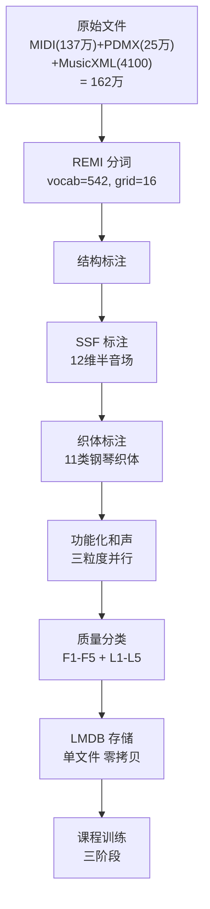

### LMDB 存储

全部 160 万+ 训练样本（token、SSF、织体、功能化和声、元数据）存储在**单一 LMDB 文件**中，替代 320 万+ 个独立 JSON 文件：

| 指标 | 扁平文件 | LMDB |
|------|---------|------|
| 文件数 | 3,263,056 | **1** |
| `__getitem__` 延迟 | ~500 μs（4 次 open+json.load） | **~50 μs**（1 次 cursor.get） |
| Dataset 初始化峰值内存 | 300 MB | **~0 MB** |
| 磁盘占用 | ~191 GB | **~29 GB** |

Token 以 raw `uint32` LE 字节存储（struct.pack），标注以 msgpack 存储——DataLoader 读取走 **零拷贝 numpy.frombuffer → torch.from_numpy**。

---

## 训练

### 三阶段课程训练

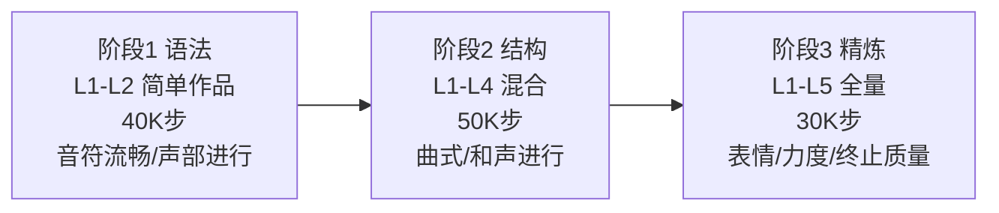

| 参数 | 值 |
|------|-----|
| 参数量 | 12.1 亿 |
| 层数 | 24 |
| 注意力头 | 32 |
| d_model | 2048 |
| d_ff | 8192 |
| 词表 | **542** |
| 上下文长度 | 4096 token |
| 显存（训练，bs=8） | ~22 GiB |
| GPU | RTX 5090 32 GB |

---

## 版本历史

| 版本 | 关键变化 |
|------|----------|
| **v0.2.6** | 段落感知注意力，和弦偏置，929 词表 |
| **v0.3.0** | SSF 编码，声部 SATB，织体，终止式，542 词表，RoPE，ABC 引擎 |
| **v0.3.1** | 声部拆分，DurSat，F1–F5 过滤，三阶段课程，终止式增强 |
| **v0.3.2** | 框架/内容分离，VoicePlan，A1 预插框架 token |
| **v0.3.3** | BeatField 三粒度 SSF，功能化和声三粒度，LMDB 统一存储 |

---

*Chopinote-AI — 让古典音乐创作从灵感开始，而不是从空白五线谱开始。*
*Chopinote-AI — Composition begins with inspiration, not a blank staff.*
