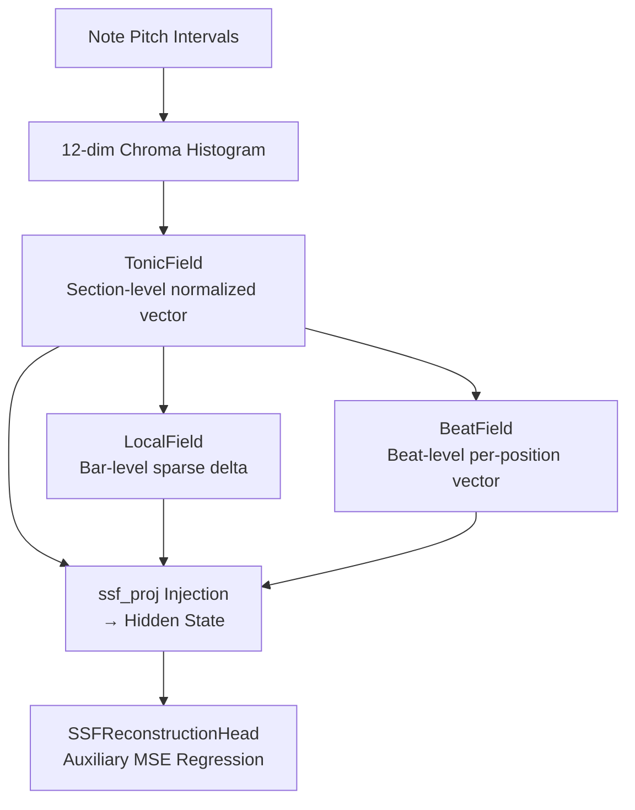
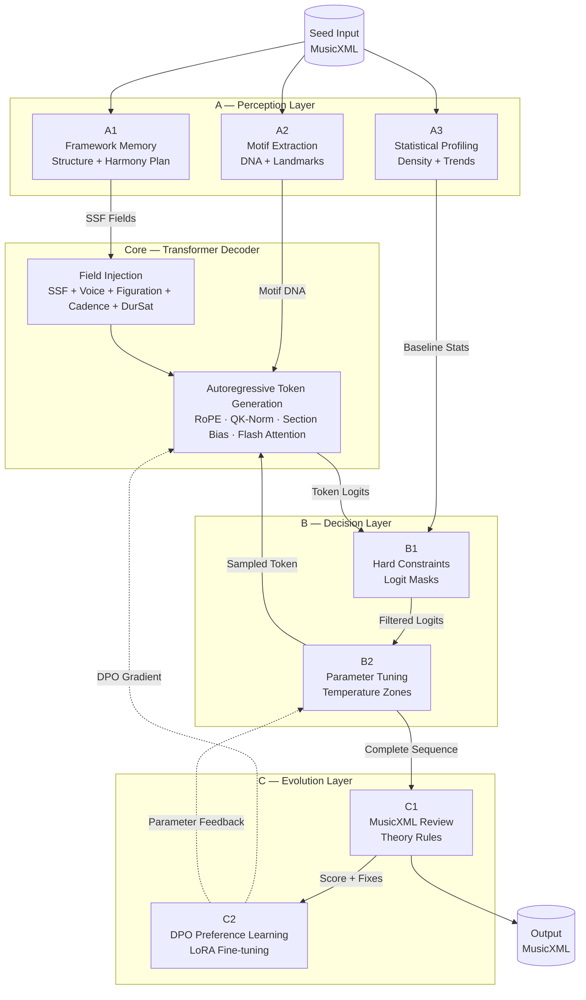
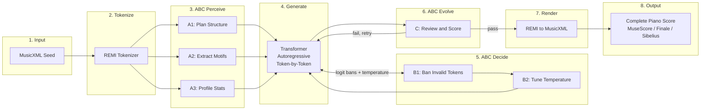
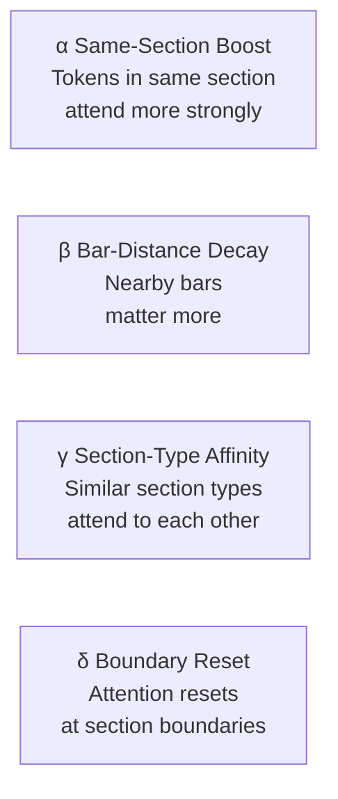
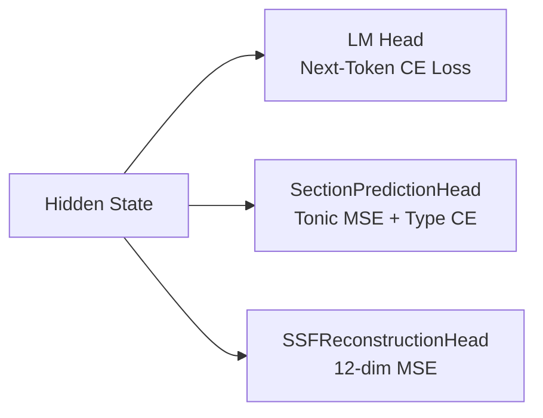
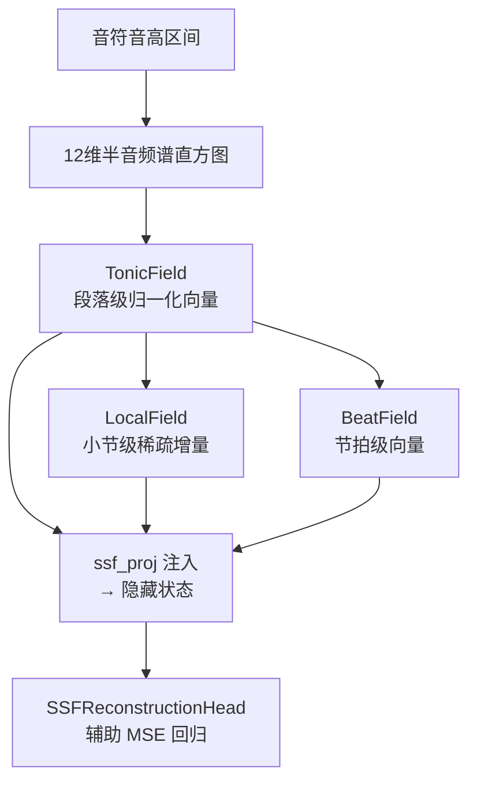
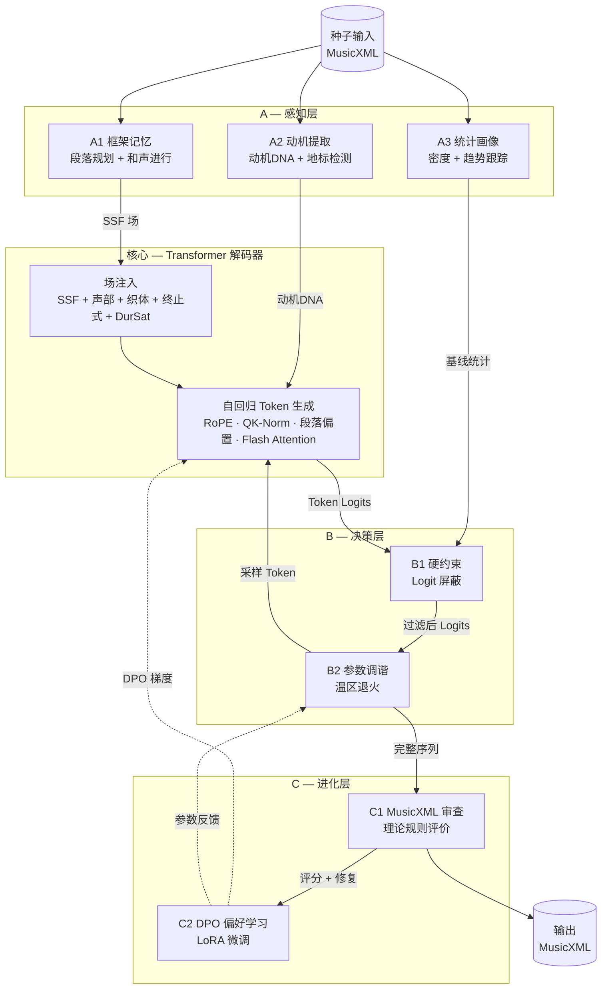
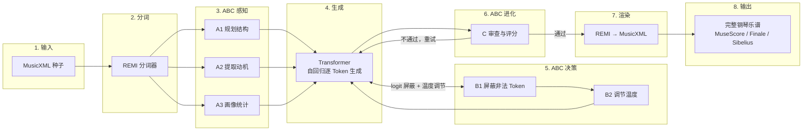
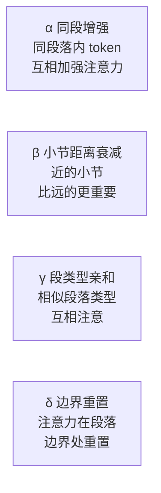
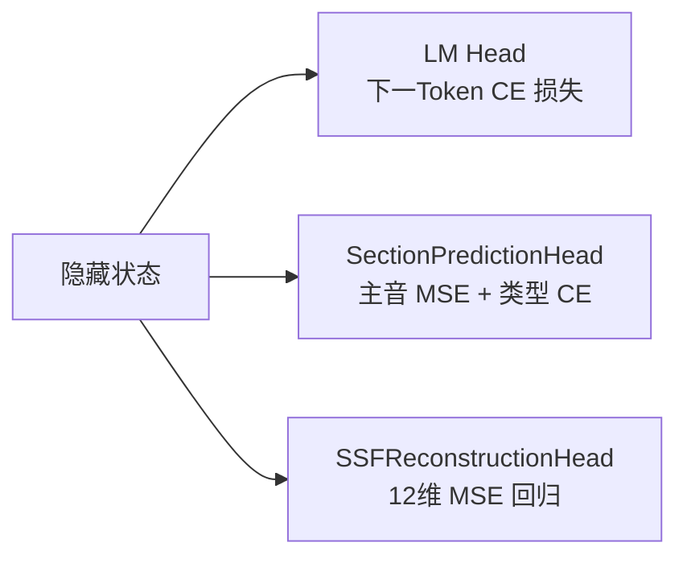

# Chopinote-AI

> Give it a few bars — it finishes the piece.
> 给它几个小节，它还你一首完整的乐曲。

Chopinote-AI is a **decoder-only Transformer** (1.21B parameters) that composes classical piano music in the style of your input. Feed it the first few measures of a piece (MusicXML), and it generates a stylistically coherent continuation — with structural awareness of musical form, tonal harmony via SSF encoding, and a six-layer ABC cognitive engine for real-time quality control.

Output is standard MusicXML, editable in MuseScore, Finale, Sibelius, or any notation software.

Chopinote-AI 是一个 **decoder-only Transformer**（12.1 亿参数），能根据输入的音乐片段续写出风格一致的作品。给它几个小节（MusicXML 格式），它就能生成结构完整、和声合理、声部清晰的古典钢琴音乐。输出为标准 MusicXML，可直接在 MuseScore、Finale、Sibelius 等制谱软件中编辑。

---

<div align="center">

**[[English](#english)] [[中文](#中文)]**

</div>

---

# English

## Why Chopinote-AI?

Most music generation models treat composition as a pure sequence prediction problem. Chopinote-AI takes a different approach — it embeds **music theory as first-class architectural priors** rather than hoping the model learns them implicitly.

### 1. SSF (Sliding Scale Field) — Continuous Tonal Encoding

Instead of discrete key/chord tokens, v0.3.x uses a **12-dimensional tonic-anchored chroma field** that continuously represents harmonic context. Modulation, chromaticism, and harmonic ambiguity are encoded naturally as continuous vectors — no discrete vocabulary needed.



| Field | Scope | Content | Storage |
|-------|-------|---------|---------|
| **TonicField** | Section-level | 12-dim chroma histogram, tonic-anchored at position 0 | Always stored |
| **LocalField** | Bar-level | Sparse delta from parent TonicField (significant deviations only) | Sparse |
| **BeatField** | Beat-level | Per-position SSF vector within each bar (v0.3.3) | Sparse |

**Key insight**: The tonic is ALWAYS at position 0 of the 12-dim vector. A C-major chord and a G-major chord in the key of C are different points in the same continuous space — the model naturally learns their relationship through MSE regression on the 12-dim field, rather than treating them as unrelated discrete symbols.

### 2. Four-Voice SATB Time Slicing

Four simultaneous voices (Soprano/Alto/Tenor/Bass) modeled with per-voice identity, replacing discrete Program tokens with 43 Program × 4 subtracks + 4 Voice tokens.


| Mechanism | Role |
|-----------|------|
| **Voice Embedding** | Per-voice identity (zero-init for training stability) |
| **Voice Bias** | Same-voice history attraction + same-position cross-voice coordination |
| **Voice Count Embedding** | Number of active voices per bar |

### 3. ABC Engine — Six-Layer Cognitive Architecture

The core innovation: a **perception → generation → decision → evolution** pipeline where the Transformer is the central generation engine, surrounded by four cognitive layers.



The Transformer sits at the **center** of the ABC Engine — it is the generation engine, not the whole system. A perceives and plans, B constrains and tunes, C reviews and evolves. The Transformer generates autoregressively, with SSF/voice/figuration/cadence fields injected at every layer, while B1 applies logit-level bans in real time.

| Layer | Subsystem | Function |
|-------|-----------|----------|
| **A1** | Framework Memory | Section planning (sonata, binary, theme-variations, free), harmonic progression templates, SSF field pre-computation via `harmony_to_ssf()` |
| **A2** | Motif Extraction | Seed motif DNA (contour, rhythm, register), landmark detection, motif transformation ops (invert, fragment, diminish) |
| **A3** | Statistical Profiling | Baseline per-bar density/rest_ratio, section snapshots, trend detection, duration tracking (DurSat) |
| **B1** | Hard Constraints | Voice range (SATB pitch limits), parallel fifths/octaves, voice crossing, duration overflow guard, note density caps |
| **B2** | Parameter Tuning | Temperature zone annealing (cold→hot→cold per section), innovation budget tracking, fatal signal detection |
| **C** | Evolution | MusicXML legality check, comprehensive theory evaluation, token↔XML cross-modal comparison, DPO preference pair collection → LoRA |

### 4. How Generation Works — End-to-End Pipeline



### 5. Section-Aware Attention — Musical Form as Learned Bias

Four complementary biases encode the formal structure of music directly into the attention mechanism:



Each bias is a scalar learned parameter, added to the pre-softmax attention scores. During training, biases are **recomputed inside gradient checkpointing** — only the compact raw section data is checkpointed rather than the full attention bias tensor, dramatically reducing VRAM across all layers.

### 6. Explicit Musical Feature Injection

Instead of treating all tokens equally, Chopinote-AI injects domain-specific features at precise positions:

| Feature | Injection Point | Encoding |
|---------|----------------|----------|
| **SSF Field** | All positions (hidden state) | 12-dim chroma vector projected into hidden state |
| **Voice Identity** | Voice token positions | Per-voice embedding (4 SATB + none) |
| **Figuration** | Figuration token positions | Per-texture embedding (11 piano textures + none) |
| **Cadence** | Cadence token positions | Per-cadence embedding (5 types + none) |
| **DurSat** | Position token positions | Per-saturation-bucket embedding (17 buckets) |
| **Measure Position** | All positions | Position-within-section embedding |
| **Functional Harmony** | Section/Bar/Beat | Three-granularity parallel embeddings |

All feature embeddings are **zero-initialized** — they start as identity and gradually learn their semantics, preventing training instability at initialization.

### 7. Figuration Encoding — 11 Piano Textures

Piano-specific figuration types are explicitly encoded rather than left for the model to infer:

```
Alberti bass  ·  Arpeggio  ·  Broken chord  ·  Chordal  ·  Octave
Scale  ·  Tremolo  ·  Trill  ·  Repeated notes
Melody + accompaniment  ·  Polyphonic
```

### 8. Cadence Awareness — 5 Types

Five cadence types with dedicated embedding and zone-based SSF boost near cadence positions:

| Type | Description |
|------|-------------|
| **PAC** | Perfect Authentic Cadence (V → I, both in root position, tonic in soprano) |
| **IAC** | Imperfect Authentic Cadence (V → I, non-root or non-tonic soprano) |
| **HC** | Half Cadence (ends on V) |
| **DC** | Deceptive Cadence (V → vi) |
| **PC** | Plagal Cadence (IV → I) |

### 9. DurSat (Duration Saturation)

Per-voice cumulative duration tracking prevents rhythmic overflow. Each voice independently tracks its remaining beat capacity within the semiquaver grid, encoded as saturation buckets and injected at Position token positions. B1 hard constraints block any Duration token that would exceed the grid capacity.

### 10. Multi-Task Training

Three loss terms guide the model beyond next-token prediction:



| Task | Head | Purpose |
|------|------|---------|
| Next-token prediction | LM Head (weight-tied with embedding) | Note fluency and style |
| Section type + tonic | SectionPredictionHead | Formal structure awareness |
| SSF reconstruction | SSFReconstructionHead | Chroma field understanding |

### 11. Memory-Efficient Design

| Technique | Benefit |
|-----------|---------|
| **RoPE** | Fast position encoding, cache-friendly |
| **QK-Norm** + per-head scaling | Prevents attention logit explosion |
| **Bias recompute in checkpoint** | Raw data checkpointed instead of full bias tensors, massive VRAM savings |
| **FP8 Linear** | Blackwell-native FP8 inference |
| **BF16 autocast** | No GradScaler needed |
| **Flash / Efficient Attention** | SDPA backends with 4D mask support |

---

## Token Vocabulary (REMI v4, 542 tokens)

| Category | Count | Details |
|----------|-------|---------|
| Special | 4 | PAD, BOS, EOS, MASK |
| Structure | 3 | Bar, Section, SecSum |
| Tonic | 12 | `<Tonic C>` ~ `<Tonic B>` |
| Voice | 4 | SATB (`<Voice 0>` ~ `<Voice 3>`) |
| Position | 16 | Grid positions |
| Note_ON | 96 | 12 pitch classes × 8 octaves |
| Velocity | 8 | Velocity levels |
| Duration | 16 | Semiquaver durations |
| Program | 172 | 43 programs × 4 subtracks |
| TimeSig | 14 | Time signatures |
| Tempo | 24 | Tempo markings |
| Figuration | 12 | 11 types + none |
| Cadence | 6 | 5 types + none |
| Markings | ~70 | Clef, dynamic, hairpin, articulation, ornament, pedal |
| Other | ~85 | Rest, Beat, Tuplet, Octave, Arpeggio, Bass, Repeat, Jump |

**Removed from v0.2.x**: Key tokens, Anticipate tokens, Chord (func/7th/Inv) tokens, unused Program tokens — replaced by SSF, Voice, Tonic, Figuration, Cadence.

---

## Model Specs

| Parameter | Value |
|-----------|-------|
| Parameters | 1.21B |
| Layers | 24 |
| Attention heads | 32 |
| d_model | 2048 |
| d_ff | 8192 |
| Vocab size | **542** |
| Context length | 4096 tokens |
| Position encoding | RoPE |
| Precision | BF16 training, FP8/BF16 inference |

---

## Quick Start

```bash
# Install
pip install -e .

# Continue a piece
chopin checkpoints/step_N.pt input.musicxml -o output.musicxml

# Generate multiple variants
chopin checkpoints/step_N.pt input.musicxml -n 5

# Custom config with style preset
chopin checkpoints/step_N.pt input.musicxml --config my_cfg.yaml --max-bars 64
```

---

## Key Design Documents

| Document | Topic |
|----------|-------|
| `docs/ssf_encoding_v0.3.x.md` | SSF tonic-anchored chroma field (三粒度) |
| `docs/voice_time_slicing_v0.3.x.md` | Four-voice SATB + Voice bias |
| `docs/figuration_encoding_v0.3.x.md` | 11 piano figuration types |
| `docs/cadence_awareness_v0.3.x.md` | Cadence zone + embedding |
| `docs/duration_saturation_v0.3.x.md` | DurSat saturation buckets + B1 guard |
| `docs/voice_splitting_v0.3.x.md` | Piano 2-track → 4-voice split |
| `docs/framework_content_separation_v0.3.x.md` | Framework/content separation |
| `docs/curriculum_training_v0.3.x.md` | F1–F5 filter + 3-phase curriculum |
| `docs/abc_engine.md` | ABC Engine full architecture |

---

## Version History

| Version | Key Changes |
|---------|-------------|
| **v0.2.6** | Section-aware attention, chord bias, 929 vocab |
| **v0.3.0** | SSF encoding, Voice SATB, Figuration, Cadence, 542 vocab, RoPE, ABC Engine |
| **v0.3.1** | Voice splitting, DurSat, quality filtering, 3-phase curriculum, cadence boost |
| **v0.3.2** | Framework/content separation, VoicePlan, A1 pre-inserted framework tokens |
| **v0.3.3** | BeatField (3-granularity SSF), functional harmony 3-granularity |

---

# 中文

## 为什么选择 Chopinote-AI？

大多数音乐生成模型将作曲视为纯序列预测问题。Chopinote-AI 走了一条不同的路——它将**音乐理论作为一等架构先验**嵌入模型，而不是指望模型隐式地学会它们。

### 1. SSF（滑动音阶场）—— 连续调性编码

v0.3.x 用 **12 维主音锚定半音场** 替代离散的调性/和弦 token，连续表示和声语境。转调、半音化和和声模糊性自然地编码为连续向量——无需离散词表。



| 场 | 作用域 | 内容 | 存储 |
|---|--------|------|------|
| **TonicField** | 段落级 | 12 维半音频谱直方图，主音固定在位置 0 | 全量 |
| **LocalField** | 小节级 | 相对所属段 TonicField 的稀疏增量（仅显著偏离时存储） | 稀疏 |
| **BeatField** | 节拍级 | 每小节内各拍位的 SSF 向量（v0.3.3 新增） | 稀疏 |

**核心洞察**：主音永远在 12 维向量的位置 0。C 大调中的 C 大三和弦和 G 大三和弦是同一连续空间中的不同点——模型通过对 12 维场的 MSE 回归自然学习它们的关系，而不是把它们当作无关的离散符号。

### 2. 四声部 SATB 时间切片

四个独立声部（女高/女低/男高/男低）通过声部身份显式建模，离散 Program token 被 43 Program × 4 子轨 + 4 个 Voice token 替代。


| 机制 | 作用 |
|------|------|
| **Voice Embedding** | 每声部独立身份嵌入（零初始化以保证训练稳定性） |
| **Voice Bias** | 同声部历史吸引力 + 同位置跨声部协调 |
| **Voice Count Embedding** | 每小节活跃声部数 |

### 3. ABC 认知引擎 — 六层认知架构

核心创新：**感知 → 生成 → 决策 → 进化** 流水线，Transformer 是中心的生成引擎，被四层认知层环绕。



Transformer 位于 ABC 引擎的**中心**——它是生成引擎，而非整个系统。A 感知并规划，B 约束并调参，C 审查并进化。Transformer 逐 token 自回归生成，SSF/声部/织体/终止式场在每一层注入，B1 实时施加 logit 级屏蔽。

| 层 | 子系统 | 功能 |
|----|--------|------|
| **A1** | 框架记忆 | 段落规划（奏鸣曲式/二段体/主题变奏/自由），和声进行模板，SSF 场预计算（`harmony_to_ssf()`） |
| **A2** | 动机提取 | 种子动机 DNA（轮廓/节奏/音区），地标检测，动机变换（倒影/片段/减值） |
| **A3** | 统计画像 | 基线逐 bar 密度/休止比，段快照，趋势检测，时值饱和度跟踪（DurSat） |
| **B1** | 硬约束 | 声部音域限制，平行五八度禁止，声部交叉检测，时值溢出防护，音符密度上限 |
| **B2** | 参数调谐 | 温区退火（段内冷→热→冷），创新预算控制，致命信号检测 |
| **C** | 进化层 | MusicXML 合法性检查，全面理论规则评价，Token↔XML 跨模态比对，DPO 偏好对收集 → LoRA |

### 4. 端到端生成流水线



### 5. 段落感知注意力 — 曲式结构作为学习偏置



四个偏置在梯度检查点内**从原始数据重建**——checkpoint 只存紧凑的原始结构数据而非完整的注意力偏置张量，大幅节省显存。

### 6. 显式音乐特征注入

与将所有 token 同等对待不同，Chopinote-AI 在精确位置注入领域特定特征：

| 特征 | 注入位置 | 编码 |
|------|---------|------|
| **SSF 场** | 所有位置（隐藏状态） | 12 维半音向量投影到隐藏状态 |
| **声部身份** | Voice token 位置 | 每声部嵌入（4 SATB + 无） |
| **织体** | Figuration token 位置 | 每织体嵌入（11 类钢琴织体 + 无） |
| **终止式** | Cadence token 位置 | 每终止式嵌入（5 类 + 无） |
| **DurSat** | Position token 位置 | 每饱和度桶嵌入（17 桶） |
| **小节位置** | 所有位置 | 段内小节位置嵌入 |
| **功能化和声** | 段/小节/节拍 | 三粒度并行嵌入 |

所有特征嵌入**零初始化**——从恒等映射开始逐步学习语义，避免训练初期不稳定。

### 7. 十一类钢琴织体显式编码

```
阿尔贝蒂低音 · 琶音 · 分解和弦 · 柱式和弦 · 八度
音阶 · 颤音 · 波音 · 重复音 · 旋律加伴奏 · 复调
```

### 8. 五类终止式感知

| 类型 | 说明 |
|------|------|
| **PAC** | 完满正格终止（V → I，均为根音位置，女高为主音） |
| **IAC** | 不完满正格终止 |
| **HC** | 半终止（停在 V） |
| **DC** | 伪终止（V → vi） |
| **PC** | 变格终止（IV → I） |

### 9. DurSat 时值饱和度

每声部独立追踪剩余时值容量，以饱和度桶编码在 Position token 位置注入。B1 硬约束阻止任何会导致时值溢出的 Duration token。

### 10. 多任务训练

三个损失项引导模型超越单纯的下一 token 预测：



| 任务 | 预测头 | 目的 |
|------|--------|------|
| 下一 token 预测 | LM Head（与 embedding 权重绑定） | 音符流畅性与风格 |
| 段落类型 + 主音 | SectionPredictionHead | 曲式结构认知 |
| SSF 重建 | SSFReconstructionHead | 半音场理解 |

### 11. 内存高效设计

| 技术 | 收益 |
|------|------|
| **RoPE** | 高速位置编码 |
| **QK-Norm** + 逐头缩放 | 防止注意力 logit 爆炸 |
| **检查点内偏置重建** | 只存原始数据不存完整偏置张量，大幅省显存 |
| **FP8 Linear** | Blackwell 原生 FP8 推理 |
| **BF16 autocast** | 无需 GradScaler |
| **Flash / Efficient Attention** | SDPA 后端 4D mask 支持 |

---

## 独创设计总结

| 设计 | 创新点 |
|------|--------|
| **SSF 三粒度连续调性场** | 替代所有离散调性/和弦 token，连续空间自然表示转调与半音化 |
| **四声部时间切片** | SATB 声部身份嵌入 + 同声部/同位置双偏置 |
| **ABC 认知引擎** | 感知→生成→决策→进化四层闭环，Transformer 在中心 |
| **段落注意力四偏置** | α/β/γ/δ 学习曲式结构，检查点内重建省显存 |
| **织体显式编码** | 11 类钢琴织体专用 embedding |
| **终止式区域感知** | 终止式前位置 SSF 场增强 |
| **DurSat 时值饱和度** | 多桶饱和度 + B1 硬约束防溢出 |
| **三阶段课程训练** | 质量过滤 + 多指标自动分类 + Gate 驱动进阶 |
| **FP8 Linear** | Blackwell 原生 FP8 推理 |

---

## 模型规格

| 参数 | 值 |
|------|-----|
| 参数量 | 12.1 亿 |
| 层数 | 24 |
| 注意力头 | 32 |
| d_model | 2048 |
| d_ff | 8192 |
| 词表 | **542** |
| 上下文长度 | 4096 token |
| 位置编码 | RoPE |
| 精度 | BF16 训练，FP8/BF16 推理 |

---

## 版本历史

| 版本 | 关键变化 |
|------|----------|
| **v0.2.6** | 段落感知注意力，和弦偏置，929 词表 |
| **v0.3.0** | SSF 编码，声部 SATB，织体，终止式，542 词表，RoPE，ABC 引擎 |
| **v0.3.1** | 声部拆分，DurSat，质量过滤，三阶段课程，终止式增强 |
| **v0.3.2** | 框架/内容分离，VoicePlan，A1 预插框架 token |
| **v0.3.3** | BeatField 三粒度 SSF，功能化和声三粒度 |

---

*Chopinote-AI — 让古典音乐创作从灵感开始，而不是从空白五线谱开始。*
*Chopinote-AI — Composition begins with inspiration, not a blank staff.*
